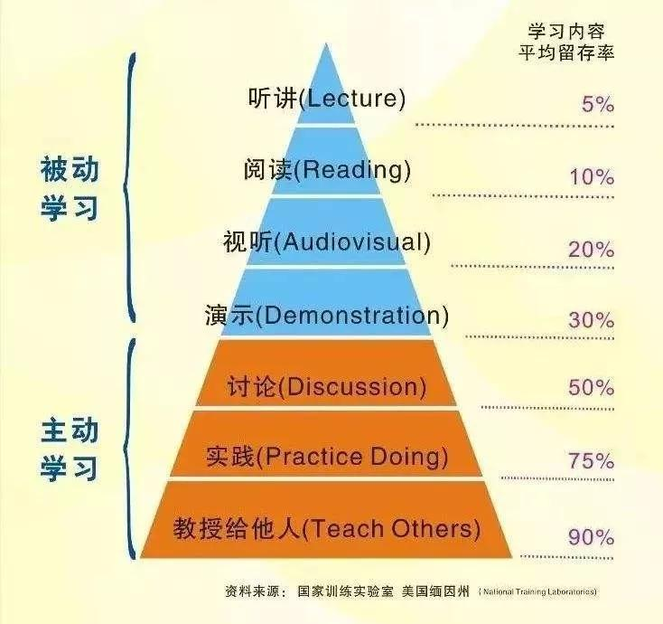

### ARTS 的初衷

**Algorithm**: 主要是为了编程训练和学习。每周至少做一个 leetcode 的算法题（先从 Easy 开始，然后再 Medium，最后才 Hard）。进行编程训练，如果不训练你看再多的算法书，你依然不会做算法题，看完书后，你需要训练。

**Review**：主要是为了学习英文，如果你的英文不行，你基本上无缘技术高手。所以，需要你阅读并点评至少一篇英文技术文章，我个人最喜欢去的地方是http://Medium.com（需要梯子）以及各个公司的技术blog，如Netflix的。

**Tip**：主要是为了总结和归纳你在是常工作中所遇到的知识点。学习至少一个技术技巧。你在工作中遇到的问题，踩过的坑，学习的点滴知识。

**Share**：主要是为了建立你的影响力，能够输出价值观。分享一篇有观点和思考的技术文章。

### 为什么要写下来

因为写作是一种非常重要的技能，写作不仅仅可以帮你组织你的思路和语言，帮你梳理你的知识，**更重要的是写作其实是一种自己对自己的思考，** 同时还可以很容易地扩散并引入其它人的讨论、指正、批评，这对个人来说是非常重要的

学习不是努力读更多的书，盲目追求阅读的速度和数量，这会让人产生低层次的勤奋和成长的感觉，这只是在使蛮力。要思辨，要践行，要总结和归纳，否则，你只是在机械地重复某件事（记忆知识），而不会有质的成长的。

ARTS 详情：[极客时间《左耳听风》发起的 ARTS 挑战怎么参加？ - 陈皓的回答 - 知乎](https://www.zhihu.com/question/301150832/answer/529809529)

### 2022新征程
**3 月**：[第 24 期](weekly/2022/arts-024.md):high_brightness:
**2 月**：[第 20 期](weekly/2022/arts-020.md)、[第 21 期](weekly/2022/arts-021.md)、[第 22 期](weekly/2022/arts-022.md)、[第 23 期](weekly/2022/arts-023.md)
**1 月**：[第 16 期](weekly/2022/arts-016.md)、[第 17 期](weekly/2022/arts-017.md)、[第 18 期](weekly/2022/arts-018.md)、[第 19 期](weekly/2022/arts-019.md)

### 2021归档
**12 月**：[第 13 期](weekly/2021/arts-0013.md)、[第 14 期](weekly/2021/arts-014.md)、[第 15 期](weekly/2021/arts-015.md)

### 2020归档
**10 月**：[第 12 期](weekly/2020/arts-0012.md)
**9 月**：[第 9 期](weekly/2020/arts-0009.md)、[第 10 期](weekly/2020/arts-0010.md)、[第 11 期](weekly/2020/arts-0011.md)  
**8 月**：[第 5 期](weekly/2020/arts-0005.md)、[第 6 期](weekly/2020/arts-0006.md)、[第 7 期](weekly/2020/arts-0007.md)、[第 8 期](weekly/2020/arts-0008.md)  
**7 月**：[第 1 期](weekly/2020/arts-0001.md)、[第 2 期](weekly/2020/arts-0002.md)、[第 3 期](weekly/2020/arts-0003.md)、[第 4 期](weekly/2020/arts-0004.md)
