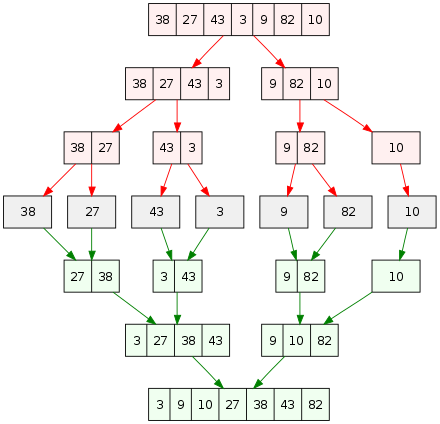

## 1.Algorithm

[1]&nbsp;&nbsp;[Find Numbers with Even Number of Digits](https://leetcode.com/problems/find-numbers-with-even-number-of-digits/description/)

**Easy** &nbsp;&nbsp; **array** &nbsp;&nbsp;
Given an array nums of integers, return how many of them contain an even number of digits.

Example 1:

```
Input: nums = [12,345,2,6,7896]
Output: 2

Explanation:
12 contains 2 digits (even number of digits).
345 contains 3 digits (odd number of digits).
2 contains 1 digit (odd number of digits).
6 contains 1 digit (odd number of digits).
7896 contains 4 digits (even number of digits).
Therefore only 12 and 7896 contain an even number of digits.
```

Example 2:

```
Input: nums = [555,901,482,1771]
Output: 1

Explanation:
Only 1771 contains an even number of digits.
```

Constraints:
```
1 <= nums.length <= 500
1 <= nums[i] <= 10^5
```

**解答**
本题可以采用常规遍历，直接对每个数进行整除10计算位数或者转出字符串算字符位数

##### (1).常规解法, 直接将数值转换成字符串，并对字符串进行位数统计

```
func findNumbers(nums []int) int {
	total := 0
	for _, val := range nums {
		valStr := strconv.Itoa(val)
		if val != 0 && len(valStr)%2 == 0 {
			total++
		}
	}
	return total
}
```

##### (2).将数值进行整除10，统计数位

```
func findNumbers(nums []int) int {
	count := 0
	for _, val := range nums {
		digit := 0
		for val >= 1 {
			val /= 10
			digit++
		}

		if digit%2 == 0 {
			count++
		}
	}
	return count
}
```

## 2.Review
[Divide-and-conquer algorithm](https://en.wikipedia.org/wiki/Divide-and-conquer_algorithm)
* In computer science, divide and conquer is an algorithm design paradigm based on multi-branched recursion. 
* A divide-and-conquer algorithm works by recursively breaking down a problem into two or more sub-problems of the same or related type,until these become simple enough to be solved directly.  
* Roundoff control



Divide-and-conquer approach to sort the list (38, 27, 43, 3, 9, 82, 10) in increasing order. Upper half: splitting into sublists; mid: a one-element list is trivially sorted; lower half: composing sorted sublists.

### Advantages
* Solving difficult problems
* Algorithm efficiency
* Parallelism
* Memory access

## 3.Tip
<<刻意练习：如何从新手到大师>>：安德斯*艾利克森 罗伯特*普尔

* 刻意练习的任务难度要适中，能收到反馈，有足够的次数重复练习，学习者能够纠正自己的错误。
* 学习科学大量研究表明，成人的最佳学习方式**并非独自练习**，而是在**情境中学习**。有效学习是进入相关情境，找到自己的“学习共同体”，学习者最开始时围绕重要成员转，做一些外围的工作，随着技能增长，进入学习共同体圈子的核心，逐步做更重要的工作，最终成为专家。
* 有目的的练习的四个特点
  * 有目的的练习具有定义明确的特定目标
  * 有目的的练习是专注的
  * 有目的的练习包含反馈
  * 有目的的练习需要走出舒适区

## 4.Share
[十大经典排序算法](https://www.runoob.com/w3cnote/ten-sorting-algorithm.html): 对计算机中常用的10种排序进行了介绍，以及不同语言的实现方式，包括C,C++,Java,Ruby,Go等。

