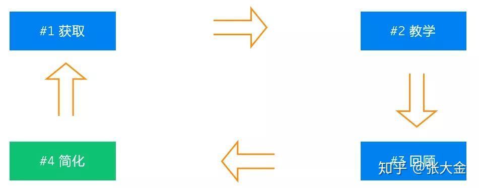

## 1.Algorithm

[2]&nbsp;&nbsp;[Add Two Numbers](https://leetcode.com/problems/add-two-numbers/)

**Easy** &nbsp;&nbsp; **array** &nbsp;&nbsp; **hash-table**

You are given two non-empty linked lists representing two non-negative integers. The digits are stored in reverse order and each of their nodes contain a single digit. Add the two numbers and return it as a linked list.

You may assume the two numbers do not contain any leading zero, except the number 0 itself.

Example:

```
Input: (2 -> 4 -> 3) + (5 -> 6 -> 4)
Output: 7 -> 0 -> 8

Explanation: 342 + 465 = 807.
```

**解答**
本题思路主要是对两个单向链表直接依次累加，同时注意累加的进位处理。在结果链表中先要构造一个dummy节点，方便进行统一处理

##### (1).基于golang语言的解法，首先构造一个dummy节点

``` golang
/**
 * Definition for singly-linked list.
 * type ListNode struct {
 *     Val int
 *     Next *ListNode
 * }
 */
func addTwoNumbers(l1 *ListNode, l2 *ListNode) *ListNode {
  carry, dummy := 0, &ListNode{}
	for node := dummy; l1 != nil || l2 != nil || carry > 0; node = node.Next {
		if l1 != nil {
			carry += l1.Val
			l1 = l1.Next
		}
		if l2 != nil {
			carry += l2.Val
			l2 = l2.Next
		}
		node.Next = &ListNode{carry % 10, nil}
		carry = carry / 10
	}
	return dummy.**Next**
}

```

##### (2).基于c语言解法，关键点是初始化结构体：(struct ListNode *)malloc(sizeof(struct ListNode))

```c
/**
 * Definition for singly-linked list.
 * struct ListNode {
 *     int val;
 *     struct ListNode *next;
 * };
 */
struct ListNode *addTwoNumbers1(struct ListNode *l1, struct ListNode *l2)
{
	int carry = 0;
	struct ListNode *dummy = (struct ListNode *)malloc(sizeof(struct ListNode));
	dummy->next = NULL;
	struct ListNode *curNode = dummy;
	while (l1 != NULL || l2 != NULL || carry > 0)
	{
		if (l1 != NULL)
		{
			carry += l1->val;
			l1 = l1->next;
		}

		if (l2 != NULL)
		{
			carry += l2->val;
			l2 = l2->next;
		}
		struct ListNode *node = (struct ListNode *)malloc(sizeof(struct ListNode));
		node->val = carry % 10;
		node->next = NULL;

		curNode->next = node;
		carry = carry / 10;
		curNode = node;
	}
	return dummy->next;
}
```

## 2.Review
[Go Data Structures: Interfaces](https://research.swtch.com/interfaces)  
* Go's interfaces: static, checked at compile time, dynamic
* Languages with methods typically fall into one of two camps: prepare tables for all the method calls statically (as in C++ and Java), or do a method lookup at each call (as in Smalltalk and its many imitators, JavaScript and Python included) and add fancy caching to make that call efficient. 
* Go sits halfway between the two: it has method tables but computes them at run time. 

[Go Data Structures](https://research.swtch.com/godata)
* Basic types: int, int32, float32, array
* Structs and pointers
* Strings: A string is represented in memory as a 2-word structure containing a pointer to the string data and a length. 
* Slices: A slice is a reference to a section of an array.
* New and make: The basic distinction is that new(T) returns a *T, a pointer that Go programs can dereference implicitly, while make(T, args) returns an ordinary T, not a pointer. 

## 3.Tip

***费曼学习法*** 来自诺贝尔物理奖获得者理查德•费曼（Richard Feynman），费曼技巧是一种「以教为学」的学习方式，能够帮助你提高知识的吸收效率，真正理解并学会运用知识。这个学习方法其实很简单，就是验证你是否真正掌握一个知识，看你能否用直白浅显的语言把复杂深奥的问题和知识讲清楚。



* 获取：即获得并初步吸收自己获得的知识
* 教学：向他人讲解你所获得的知识/或者也可以想象给别人讲解的自言自语
* 回顾：由他人或者自己对自己的教学进行评价，并回顾讲的不好的地方
* 简化：简化=划重点 提炼并升华知识

### 第一步：选择目标
选择目标，确认自己要学什么，或者要干什么，如学习一门技术、学习一个科学领域、学习一门语言、学习一个概念等

目标的SMART 原则：Specific 具体、Measurable 可测量、Attainable 可实现、Relevant 相关性、Time—based 时效性。也就是说计划要具体、可测量、坚持即可实现、对你有意义并且要在一定的期限内完成。

### 第二步：教学
创造一个场景，在这个场景中将自己学到的知识讲授给 “别人”。在这个过程中会遇到很多问题，比如说不清楚，讲不明白，自己也模棱两可等，那就说明这些知识点并没有熟练掌握。尝试教授和发现薄弱点就是这一步的重点。

### 第三步：纠错学习
在第二步中遇到了问题，那么就需要进入第三步 —— 纠错学习。无论是在教授的过程中说错的、说不清楚的、模棱两可的都需要在这一步中进行强化。反复查询资料、学习、强化记忆，然后再重复第二步进行验证，直到可以顺利的教授相应的知识。

第二步和第三步的结合有别于传统的题海战术，题海战术之所以效果不好，是因为大多数人大多数情况下只是在做自己会做的，而忽略了不会的内容，也就是 ***“用低廉的勤奋代替高质量的思考”。***

### 第四步：简化
这一步是对上面学习的内容进行提炼、简化，去掉非必要的，多余的信息，并且能够用自己的语言通俗易懂的表达出来，而不是照本宣科。

其实这一步骤还有一个重点，就是简化到可以通过类比，让一个非专业人士（夸张点说就是小孩儿）都能听懂。此时，你就真正掌握了这门学习方法。

参考资料：[费曼学习法简介](https://www.feimandao.com/), [费曼学习法 / 费曼技巧 FEYNMAN TECHNIQUE](https://zhuanlan.zhihu.com/p/118183282)

## 4.Share
这周搜索有关学习方法的时候，了解到有关费曼学习法，而知乎上有个”图灵的猫“有几个有关系学习视频。比如以下几个视频, 感觉还是不错的
* [如何让自己像刷知乎/微博/抖音一样沉迷于学习？](https://www.zhihu.com/zvideo/1214220660312375296)
* [为什么学渣给学霸讲题，学习收益更高？费曼学习法的误区](https://www.zhihu.com/zvideo/1212071792787243008))
* [如何让自己像打王者荣耀一样发了疯、石乐志一般地学习？](https://www.zhihu.com/zvideo/1210907275587715072)
* [【思维论11】你真的了解拖延症吗？4个方法让你彻底告别拖延](https://www.zhihu.com/zvideo/1250572158327373824)
* [如何在28岁就实现财务自由？——和郭宇相比，我们缺少哪些东西](https://www.zhihu.com/zvideo/1257762578425950208)
* ***[如何成为一个很厉害的人？改变你一生的视频](https://www.zhihu.com/zvideo/1235609071417860096)***