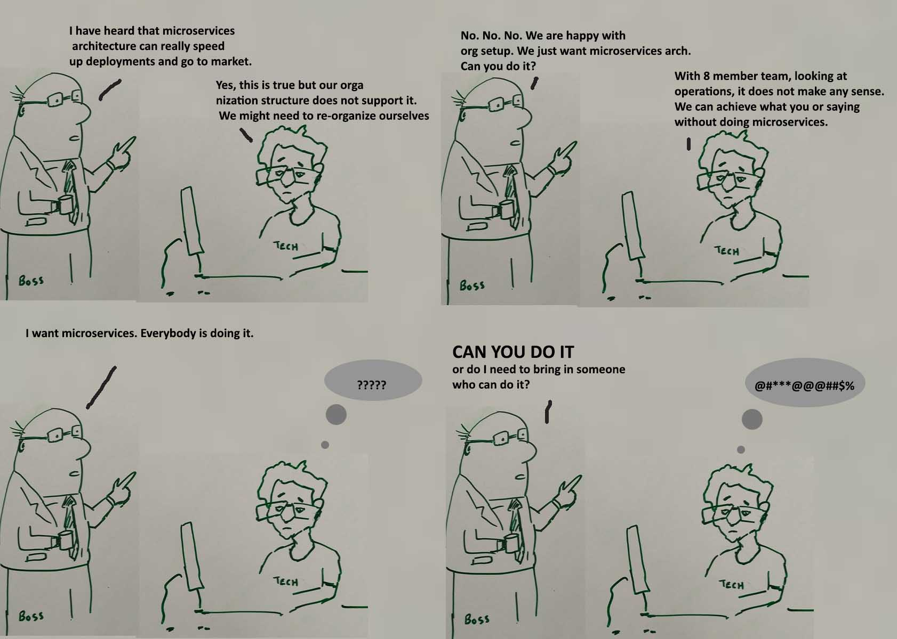

## 1.Algorithm

[7]&nbsp;&nbsp;[Reverse Integer](https://leetcode.com/problems/reverse-integer/description/)

**Easy** &nbsp;&nbsp; **Math**

Given a 32-bit signed integer, reverse digits of an integer.

Example1:

```
Input: 123
Output: 321
```

Example2:

```
Input: -123
Output: -321
```

Example3:

```
Input: 120
Output: 21
```

**解答**
本题主要是采用数学知识“除法”与“余数”的理论，但是实际反转累加的过程中必须注意**计算机存储整型(int)的溢出**

##### (1).golang实现，时间复杂度 O(log(n))

```golang
func reverse(x int) int {
	const (
		MaxInt = 1<<31 - 1
		MinInt = -1 << 31
	)
	retVal := 0
	for x != 0 {
		retVal = retVal*10 + x%10
		x = x / 10
	}
	if retVal > MaxInt || retVal < MinInt {
		return 0
	}
	return retVal
}
```

##### (2).c实现，时间复杂度 O(log(n))

```c
#include <limits.h>

int reverse(int x)
{
	long long retVal = 0;
	while (x != 0)
	{
		retVal = retVal * 10 + x % 10;
		x = x / 10;
	}

	return (retVal < INT_MIN || retVal > INT_MAX) ? 0 : retVal;
}
```

## 2.Review

[Microservices in Adopt?](https://www.thoughtworks.com/insights/blog/microservices-adopt)

* a minimum level of maturity needed in things like continuous delivery and infrastructure automation practices before microservices should be considered.
* the placement of the boundaries between services.
* The flexibility, the independent scalability, the evolutionary characteristics, the strong encapsulation are still very real benefits to a microservices approach.

[Microservices — Not a Silver Bullet](https://dzone.com/articles/microservices-not-a-silver-bullet)



### Overheads of Microservices:

* Interservice communication is a huge challenge
* Service discovery and registration
* Load balancing
* Decentralized Data Management
* Distributed Logging
* Monitoring
* Security
* Testing
* Performance/metrics
* Distributed transactions
* Containers - Docker/Kubernetes
* API Gateways
* Circuit breaker
* CI/CD and DevOps

### There are questions that need to be answered:

* Why do you want to move to microservices?
* What benefits are you looking for?
* Is your organization ready for both structural and cultural change?
* Do you have engineering expertise already available in your company?
* How much do you want to migrate? When do you stop?
* Do the benefits outweigh the cost of such transformation?

### should not go for microservices

* Scenario 1: Small Team
* Scenario 2: Organization Structure and Culture
* Scenario 3: Startups Which Are Trying to Prove a Business Idea PoC
* Scenario 4: Non-Engineering Organizations

## 3.Tip

## 4.Share

[Microservice Trade-Offs](https://martinfowler.com/articles/microservice-trade-offs.html)

### Benefits

* Strong Module Boundaries
* Independent Deployment
* Technology Diversity

### Costs

* Distribution
* Eventual Consistency
* Operational Complexity

[Microservice Premium](https://martinfowler.com/bliki/MicroservicePremium.html)

* don't even consider microservices unless you have a system that's too complex to manage as a monolith.
* Conway's Law says that the structure of a system follows the organization of the people that built it. Some examples of microservice usage had organizations deliberately split themselves into small, loosely coupled groups in order to push the software into a similar modular structure - a notion that's called the Inverse Conway Maneuver.
  

