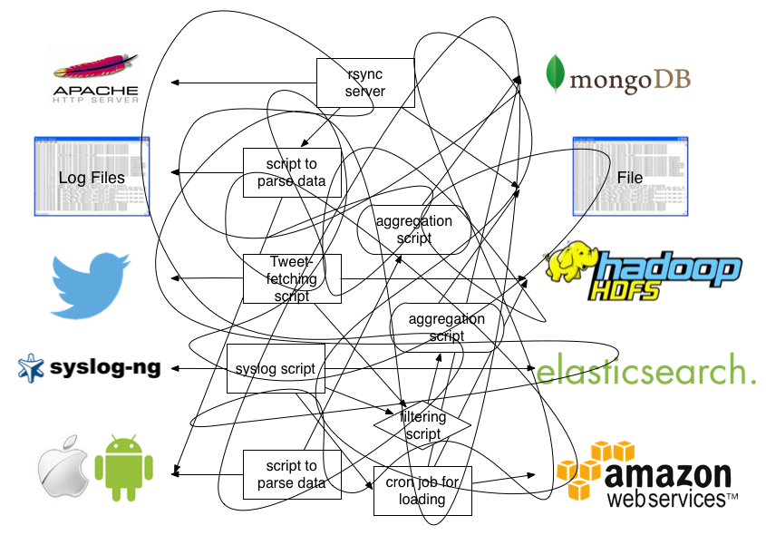

目录导航
[TOC]

## 1.Algorithm
[908]&nbsp;&nbsp;[Smallest Range I](https://leetcode.com/problems/smallest-range-i/)

**Easy** &nbsp;&nbsp; **array** &nbsp;&nbsp; **math**

Example1:

```c
Input: nums = [1], k = 0
Output: 0
Explanation: The score is max(nums) - min(nums) = 1 - 1 = 0.
```

Example2:

```c
Input: nums = [0,10], k = 2
Output: 6
Explanation: Change nums to be [2, 8]. The score is max(nums) - min(nums) = 8 - 2 = 6.
```

Example3:

```c
Input: nums = [1,3,6], k = 3
Output: 0
Explanation: Change nums to be [4, 4, 4]. The score is max(nums) - min(nums) = 4 - 4 = 0.
```

Constraints:
```
1 <= nums.length <= 104
0 <= nums[i] <= 104
0 <= k <= 104
```

**解答**
采用最简单的解法，寻找数组中最大值和最小值。
这个题目本身不难，刚开始读题的时候，感觉有点困惑，但是细想下来，解题思路还是挺简单的。leetcode官网也有很多人吐槽该题目，读题15分钟，解题2-3分钟。[Very confusing question!](https://leetcode.com/problems/smallest-range-i/discuss/178344/Very-confusing-question!)
##### (1).常规解法, 1 层循环，时间复杂度 O(n)

```
func smallestRangeI(nums []int, k int) int {
  if len(nums) == 0 {
    return 0
  }

  minVal, maxVal := nums[0], nums[0]

  for _, val := range nums {
    if val < minVal {
      minVal = val
    }
    if val > maxVal {
      maxVal = val
    }
  }

  val := maxVal - minVal - 2 * k
  if val < 0 {
    return 0
  }
  return val
}
```

##### (2).类似方法1，网上最优的Go解法，与解法1类似

```
func smallestRangeI(nums[] int, k int) int {
  min, max := nums[0], nums[0]
  for _, x := range nums {
    if x < min {
      min = x
    }
    if x > max {
      max = x
    }
  }

  min += k
  max -= k
  score := max - min
  if score < 0 {
    return 0
  }
  return score
}
```

## 2.Review - Fluentd
以下几篇有关Fluentd入门的文章，ELK是非常传统的日志收集方式，而在演进的过程中往往会引入Fluentd作为数据的采集端，演变成EFK的架构模式。（再加上轻量级的Grafana+Loki的方式，几种主流的日志方案都算齐了）
* [What is Fluentd?](https://www.fluentd.org/architecture)
* [Why Use Fluentd?](https://www.fluentd.org/why)
* [Unified Logging Layer: Turning Data into Action](https://www.fluentd.org/blog/unified-logging-layer)
* [Frequently Asked Questions](https://www.fluentd.org/faqs)
* [Fluentd vs Logstash: A Comparison of Log Collectors](https://logz.io/blog/fluentd-Logstash/)
* [Kubernetes Logging: Comparing Fluentd vs. Logstash](https://platform9.com/blog/kubernetes-logging-comparing-fluentd-vs-logstash/)
* [5 ELK Stack Pros and Cons](https://www.chaossearch.io/blog/elk-stack-pros-and-cons)




摘录几个比较重要的点：
* Fluente is an open source data collector, which let you unify the data collection and comsumption for a better use and understanding of data.
* the key features:
  * Unified Logging with JSON
  * Pluggable Architecture
  * Minimum Resources Required
  * Built-in Reliability

## 3.Tip - Markdown生成目录
Markdown生成目录的技巧，之前一直会Markdown写一些文档，但是自己很少关注Markdown生成文档的效果是否有目录结构。
### 方式1. 自动生成目录
在Markdown中，自动生成目录非常简单，只需要在恰当的位置上添加[TOC]符合（包括两个大括号），凡是以 **#** 定义的标题都会编排到目录中
### 方式2. 手动书写目录
将[列表]和[页内超级链接]相结合
- [标题一](#一级标题)
  - [标题1-1](#二级标题 1-1)

参考资料：
* [Markdown 生成目录](http://www.imooc.com/wiki/markdownlesson/markdowntoc.html)
* [Markdown语法整理](https://guo365.github.io/study/Markdown.html#41)

## 4.Share - 郭东白老师的架构课
今天主要分享郭东白老师的架构课中的架构师的生成法则三：架构师永远需要在有限资源下最大化商业价值。架构师的可用资源，包括商业成本、研发成本、时间成本、迁移成本等等。

* 《架构师如何找到自己的商业模式？》
  * 为自己所在的企业创造出可度量的商业价值，这是我们获得有质量的长期收入的重要前提。
  * 为公司赚钱的三个路径：(1).实现一个商业模式，(2).提升一个商业模式的效率 (3).加速一个商业模式的收敛速度
  * 理解一个企业或者团队的商业模式：理解自己所处的工作环境
  * 每个人都要有自己的商业模式：为公司、部门或团队提供可量化的增量价值
  * 架构师如何创造自己的增量价值：
    * 架构师的产出不完全靠自己，而是靠撬动一群人来完成架构目标
    * 一个架构师想要创造长期的商业价值，就必须同时满足三个条件：
      * 确保最终架构方案的可行性
      * 确保参与方达成一个合理的实施路径，最终能够完成实施
      * 确保设计方案可以最大化解决方案的结构性
    * 做架构和做业务一样，都不能靠饱和攻击取胜，而是靠对阶段性精确目标的最大化投入来取得进步。
* 《架构师如何在一定时间内最大化自己的增量价值？》
  * 如何寻找扩大收入的机会？-》在小数据里看大机会，在大数据里看小机会
    * 靠数据来打磨用户体验。也就是通过数据分析找到机会点，然后通过产品和技术的改进，不断提升转化减少损失。
    * 看到了别人忽略的小痛点，或者在别人不去排查的小异常上执着探索，才最终跨越了现实的障碍。
    * 在别人容易忽视的痛点和异常点上，深度挖掘可能大规模复制的机会，不失为扩大收入的好方法。
  * 如何寻找减少成本的机会？
    * 在一个企业中，追求完美必须以成本可控为前提。

其实不管作为架构师或者个人，都要考虑自己的价值，作为企业的一员，如果你不能为公司创造价值，不能为部门，不能为团队创建价值，那你就是一个多余的人，很可能处于边缘或者即将被淘汰的角色。最近一年多在外面进行项目实施的架构，但是整个项目的定制化开发成本太高，人力成本，沟通成本等都非常巨大，而如何快速的演进，打磨成一款标准化的，可快速实施落地的产品是非常值得研究的事情，当然这其中也会有很多阻力，如何平衡各种利益的关联方，能否标准化的架构理念能推行，必将是一项艰巨的任务。