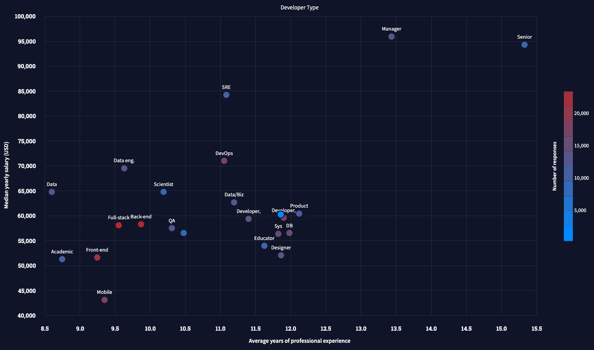

## 1.Algorithm

[383]&nbsp;&nbsp;[Ransom Note](https://leetcode.com/problems/ransom-note/)

**Easy** &nbsp;&nbsp; **String** &nbsp;&nbsp; **hash-table**

Given two stings ransomNote and magazine, return true if ransomNote can be constructed from magazine and false otherwise.

Each letter in magazine can only be used once in ransomNote.

Example 1:

```
Input: ransomNote = "a", magazine = "b"
Output: false
```

Example 2:

```
Input: ransomNote = "aa", magazine = "ab"
Output: false
```

Example 3:

```
Input: ransomNote = "aa", magazine = "aab"
Output: true
```

**解答**

##### (1).

```

```

##### (2).

```

```

## 2.Review
* [Stack Overflow Annual Developer Survey - 2021](https://insights.stackoverflow.com/survey/2021)
从这份报告里获取到一些对自己有帮助的信息：
  * 数据库：MySQL，PostgreSQL和SQLite使用占比非常高
  * 云平台：AWS占绝对地位，或许由于k8的容器编排技术的发展，Google Cloud和Microsoft Azure市场份额也越来越高了
  * Web frameworks：React.js超过jQuery， Express，Angular, Vue.js都是主流的前端框架
  * 开发者的基础工具：Git占比高达93.43%，Docker占比48.85%，Yarn和Kubenetes占比都超过了15%
  * 最想学的编程语言：Rust占比高达86.98%, 排在前列的分别是：Rust，Clojure,TypeScript,Elixir,Julia,Python,Dart,Swift,Node.js,Go
  * 最想学的数据库：Redis和PostgreSQL占比都高达70%多，其次是MongoDB, Elasticsearch,Firebase
  * 最喜欢的前端框架：Svelte，ASP.NET Core,FastAPI排在榜首，其次是React.js,Vue.js,Express,Spring; 或许是许久没关注前端了，Svelte这个框架之前一直也没关注听过。
  * 工资，经验与开发者的对应关系：
  * 工资，经验与开发语言的关系：

   以上两张对应关系图，还是比较有意思，或许对我们如何选择新的学习语言，有一定参考价值

## 3.Tip

## 4.Share