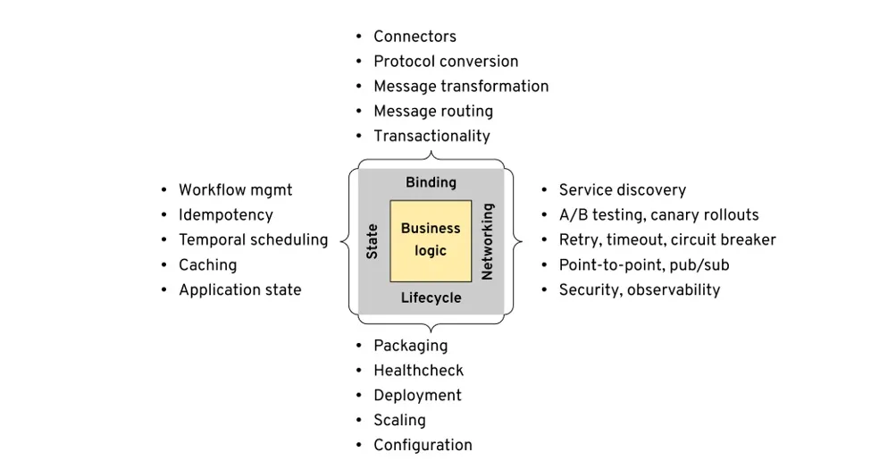

## 1.Algorithm

[796]&nbsp;&nbsp;[Rotate String](https://leetcode.com/problems/rotate-string/)

**Easy** &nbsp;&nbsp; **String** &nbsp;&nbsp; **String Matching**

Given two strings s and goal, return true if and only if s can become goal after some number of shifts on s.
A shift on s consists of moving the leftmost character of s to the rightmost position.
For example, if s = "abcde", then it will be "bcdea" after one shift.

Example 1:

```
Input: s = "abcde", goal = "cdeab"
Output: true
```

Example 2:

```
Input: s = "abcde", goal = "abced"
Output: false
```

Constraints:

```
1 <= s.length, goal.length <= 100
s and goal consist of lowercase English letters.
```

**解答**
本题可以采用常规的方法和基于 hashtab 的方式进行处理(题目描述中已经定义不存在重复的数据)

##### (1).常规解法, 2 层循环，时间复杂度 O(n\*n)

```

```

##### (2).基于 Hash，算术运算, 改成 1 层循环，时间复杂度 O(n)， 用空间换时间的思路

```

```

## 2.Review
* [Multi-Runtime Microservices Architecture](https://www.infoq.com/articles/multi-runtime-microservice-architecture/)

* [Lambda architecture](https://en.wikipedia.org/wiki/Lambda_architecture)
  * Lambda architecture is a data-processing architecture designed to handle massive quantities of data by taking advantage of both batch and stream-processing methods
  * Batch layer: using a distributed processing system that can handle very large quantities of data
  * Speed layer: processes data streams in real time and without the requirements of fix-ups or completeness
  * Serving layer: Output from the batch and speed layers are stored in the serving layer, which responds to ad-hoc queries by returning precomputed views or building views from the processed data.
.png)
* [What is Kappa architecture](https://www.educative.io/edpresso/what-is-kappa-architecture)
  * Lambda vs. Kappa architecture
  * Lambda
    * Separate layers for batch and steaming
    * Higher code complexity,i.e.,maintain 2 technology stacks for batch and stream
    * Faster performance with batch and stream layer
  * Kappa
    * Unified layer for both batch and stream
    * Lower code complexity,i.e,maintain single technology stack for batch and stream layer
    * Processing large amounts of data from database would be expensive
* [Questioning the Lambda Architecture](https://www.oreilly.com/radar/questioning-the-lambda-architecture/)
* [Kappa Architecture is Mainstream Replacing Lambda](https://www.kai-waehner.de/blog/2021/09/23/real-time-kappa-architecture-mainstream-replacing-batch-lambda/)
* [Big data architectures](https://docs.microsoft.com/en-us/azure/architecture/data-guide/big-data/)

## 3.Tip
* 架构流程工具的思考
  我是一个ProcessOn的重度用户者，平时画架构图，流程图都会使用这个工具，但是因为这个是收费工具，也是网络版的，自己一直想往Draw.io和亿图上转，这周打开亿图，发现他们也采用ProcessOn的会员模式，会员提供一批模板可以使用，同时会员也可以制作模板供别人购买使用。而Draw.io上的图例比较少，之前一直是基于ProcessOn上阿里云那套图例去画的，“将ProcessOn上经典的图例放到Draw.io上”，这样就可以完美的进行切换，接下来会尝试慢慢适应Draw.io的使用方式。
  [阿里云的云速搭 CADT](https://www.aliyun.com/product/developerservices/cadt)，也是一个基于阿里云服务的架构管理工具，里面提供了一些经典的架构部署案例，同时可以对云上架构方案的成本、部署、运维、回收进行全生命周期的管理。非常值得好好研究学习的一个架构案例。

## 4.Share
* [“核”聚变 核心系统转型之路](https://mp.weixin.qq.com/s/P3mOjOxxQ9C4lr3eDTFPEA)
  银行核心系统转型，当前在国家数字化转型的大背景推动下，可以加快各大银行的核心系统转型。以前都吐槽银行的技术比较落后，系统老旧，随着阿里提出的“金融级云原生”概念，对整个金融行业引入互联网的一些技术具有一定的指导意义，同时随着各大银行核心系统的升级，随之会带来核心系统周边系统的升级改造，也将促使传统集成商对自己的技术进行升级改造，才能适应新时代的要求。